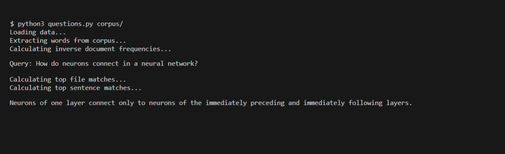

# Questions

## An AI to answer questions

`Loading data...
Extracting words from corpus...
Calculating inverse document frequencies...
Query: How do neurons connect in a neural network?
Calculating top file matches...
Calculating top sentences matches...
Neurons of one layer connect only to neurons of the immediately preceding and immediately following layers.`

Question Answering (QA) is a field within natural language processing focused on designing systems that can answer questions. 

This is a question answering system based on **inverse document frequency** that will perform two tasks: document retrieval and passage retrieval.

First, the system will have access to a corpus of text documents. When presented with a query (a question in English asked by the user), document retrieval will first identify which document(s) are most relevant to the query. To find the most relevant documents, we’ll use tf-idf to rank documents based both on term frequency for words in the query as well as inverse document frequency for words in the query. 

Then, once the top documents are found, passage retrieval will subdivide the top document(s) into passages (in this case, sentences) and score them using a combination of inverse document frequency and a query term density measure, so that the most relevant passage to the question can be determined.

## Implementation

### preprocess 

The preprocess function accept a string as input and return a lower cased list of its words. 
The following methods are implemented inside this function: 
* nltk’s `word_tokenize()` - Perform tokenization (split the string into words).
* `lower()` - Convert all characters to lowercase.
* `isalpha()` - Remove any word that does not contain at least one alphabetic character.

### non-terminals global variable

This is a set of context-free grammar rules that, when combined with the rules in the `TERMINALS` global variable, allow the parsing of all sentences in the `sentences` directory.

Constraints: 
* Avoid over-generation of sentences, sentences like "Armchair on the sat Holmes" aren't meant to be accepted by the parser.
* Avoid  under-generation of sentences. A very long and specific rule like `(S -> N V Det Adj Adj Adj N P Det N P Det N)` would technically successfully generate sentence 10, but isn't useful or generalizable.
* Try to be as general as possible without over-generating. The parser should accept the sentences: “Holmes sat in the armchair”, “Holmes sat in the red armchair” and “Holmes sat in the little red armchair”, but not the sentence: “Holmes sat in the the armchair”.

### np_chunk

The np_chunk function accept a tree representing the syntax of a sentence (nltk.tree object) and return a list of all the noun phrase chunks in the sentence tree.
A noun phrase chunk is defined as any subtree of the sentence whose label is "NP" that does not itself contain any other noun phrases as subtrees.
The following methods are implemented inside this function in order to manipulate the nltk.tree object:
* nltk’s `subtrees()` - Generate all the subtrees of a tree, optionally restricted to trees matching the filter function.
* nltk’s `label()` - Return the node label of the tree.

## Resources
* [CS50 AI Language Lecture][cs50 lecture]
* [How to Clean Text for Machine Learning with Python][clean text]
* [Python | Nested Dictionary][nested dictionary]
* [Breaking Ties: Second Sorting][second sorting]

## Installation
Inside of the `questions` directory:

* `pip3 install -r requirements.txt` | Install this project’s dependency: nltk for natural language processing.

## Usage
Inside of the `questions` directory:

* `python3 questions.py corpus` | Accepts the corpus of documents via a directory, and the query via user input.

## Credits
[*Luis Sanchez*][linkedin] 2020.

A project from the course [CS50's Introduction to Artificial Intelligence with Python 2020][cs50 ai] from HarvardX.

[cs50 lecture]: https://youtu.be/_hAVVULrZ0Q?t=4158
[clean text]: https://machinelearningmastery.com/clean-text-machine-learning-python/
[nested dictionary]: https://www.geeksforgeeks.org/python-nested-dictionary/
[second sorting]: https://runestone.academy/runestone/books/published/fopp/Sorting/SecondarySortOrder.html
[linkedin]: https://www.linkedin.com/in/luis-sanchez-13bb3b189/
[cs50 ai]: https://cs50.harvard.edu/ai/2020/
